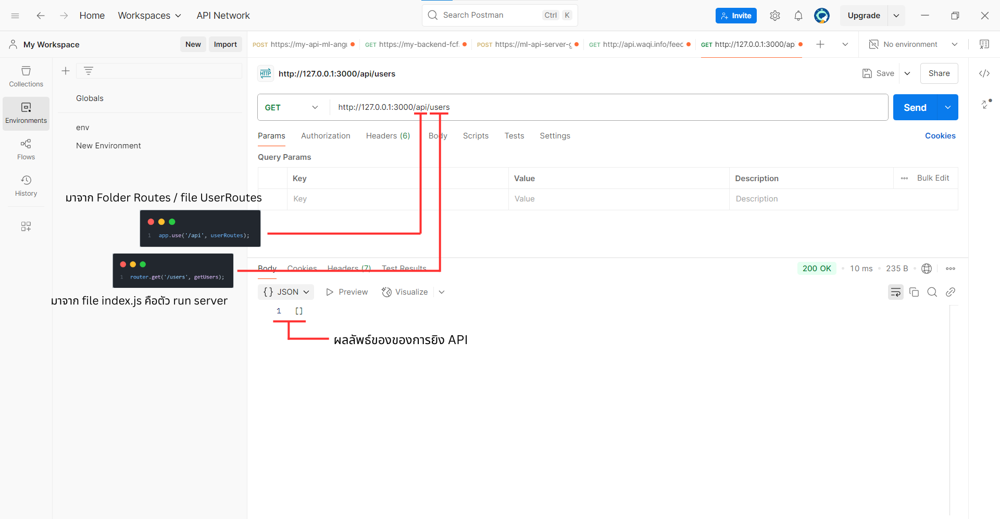

# โปรเจกต์ของคุณ

โปรเจกต์นี้ใช้ Docker Compose สำหรับการตั้งค่าบริการต่างๆ เช่น backend, database และอื่นๆ ที่เกี่ยวข้อง

## วิธีการติดตั้งและรันโปรเจกต์

1. **Clone repository**:

    ```bash
    git clone https://github.com/username/repository-name.git
    cd repository-name
    ```

2. **สร้างไฟล์ `.env` สำหรับตั้งค่าต่างๆ** (ถ้ามี)

    ตัวอย่างเช่น:
    ```
    DB_HOST=localhost
    DB_PORT=5432
    DB_USER=username
    DB_PASSWORD=password
    ```

3. **รัน Docker Compose**:

    รันคำสั่งนี้ในโฟลเดอร์โปรเจกต์:

    ```bash
    docker-compose up -d  # สร้างและรัน Docker container ในโหมด background
    docker-compose down -v  # ลบ containers และ volumes ทั้งหมด
    ```

    คำสั่งนี้จะดึง Docker images และเริ่ม container ที่จำเป็นทั้งหมด

4. **รัน Node.js Server**:

    หลังจากที่ Docker Compose รันเสร็จแล้ว, คุณต้องรัน Node.js server ด้วยตนเองโดยใช้คำสั่งต่อไปนี้:

    ```bash
    npm install  # ติดตั้ง dependencies ที่จำเป็น
    node index.js    # รัน server
    ```

    เมื่อรันคำสั่งนี้, server จะเริ่มทำงานที่ `http://localhost:3000` (หรือพอร์ตที่กำหนดในโค้ดของคุณ)

## การทดสอบ API ด้วย Postman



เมื่อเซิร์ฟเวอร์รันแล้ว, คุณสามารถทดสอบ API โดยการใช้งาน Postman:
1. เปิด Postman และเลือก **Import** เพื่อเพิ่ม collection ของ API
2. เมื่อคุณเรียกใช้งาน API ผ่าน Postman แล้ว คุณสามารถเพิ่มรูปภาพลงในคำขอของ Postman ได้โดยการใช้ **form-data**:
   - เลือกประเภทคำขอเป็น `POST` หรือ `PUT` ตาม API ของคุณ
   - เลือก `form-data` ในแท็บ body
   - กรอก key เป็น `file` หรือชื่อที่ API ต้องการ
   - เลือกรูปภาพจากเครื่องของคุณ
3. ทดสอบการเชื่อมต่อและตรวจสอบการตอบกลับจาก API

การทดสอบยิง API 
1.ให้ REGISTER ให้เรียบร้อย
localhost:3000/api/register ใช้ POST
2.แล้ว login ให้เสร็จจะได้ Token มา
localhost:3000/api/login ใช้ POST
3.เอา Token อันนั้นไปใช้แทนการล็อคอิน
Authorization: Bearer //JWT_TOKEN//
4.แล้วเอา Token ไปใช้ในต่างเช่นการยืนยันบัตรประชนชน
localhost:3000/api/verify-citizen ใช้ POST
ถ้าทำผ่าน is_seller ใน DATABASE จะกลายเป็น TURE ถึงจะลงขายของได้ถ้ายังไม่เพิ่มจะลงขายไมได้ (ลองมาแล้ว)
5.การลงขายสินค้า
localhost:3000/api/products ใช้ POST
ต้องใช้ FROM_DATA ไม่ใช่ JSON ปกติเพราะมีการเพิ่มไฟล์รูป
6.การดูสินค้าของ USER แต่ละคน
localhost:3000/api/my-products ใช้ GET
อันนี้คร่าวๆคือในแต่ละ USER จะมีการGEN IDขึ้นมาเมื่อมึการสมัครสมาชิกเราจะดึงค่ามาจากIDส่วนนั้นมาปั้มให้กับสินค้าแต่ละชิ้นเพื้่อดึงค่ามาแค่สินค้าที่เป็นIDของUserคนนั้น
7.การลบสินค้าอันนี้คิดอยู่ว่าจะใช้ชื่อหรืออะไรดี
localhost:3000/api/products/:id
อันนี้ไม่ใช้ id ของ user แต่เป็น ID ของที่GENขึ้นมา

DATABASE ที่ต้องเพิ่มจะเพิ่มใว้ให้ใน sql
